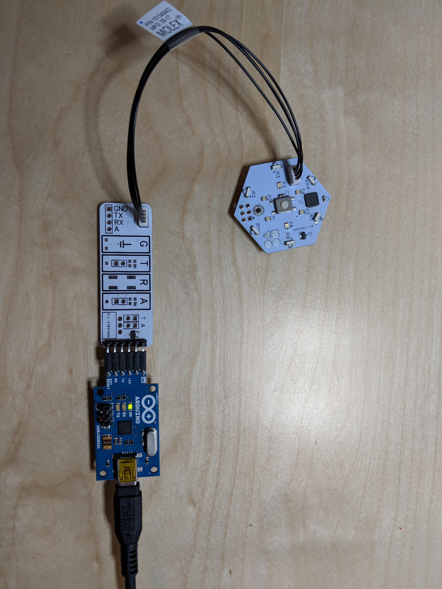

## Blinks Dev Candy Board	
This little board can be helpful when developing software to run on the blinks game tile platform.

It features:

1. A serial port converter designed to connect to a standard 3.3V or 5V USB serial adapter. This port lets the software on the tile communicate with a terminal window on a computer. Very handy for debugging. 
2. Breaks out up to 3 IO pins for connections to an oscilloscope or logic analyzer.
3. Optional button for an extra input into the blink.
4. Optional digital LEDs for up to 3 extra outputs from the blink.
5. Optional analog dial wheel for an extra input into the blink.

### Minimal serial port usage

To use as a serial adapter, you only need to populate the JST connector, the 6 pin header, and the P-Chan MOSFET...

For more information, see the `cores/sp.h` header in the `blinks-arduino-platform` repo.

   
